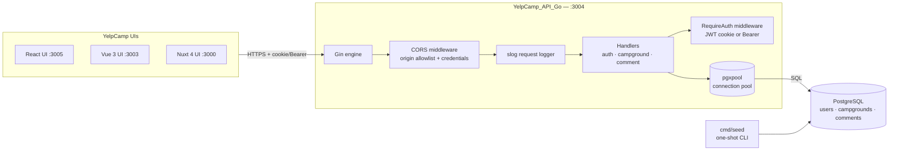
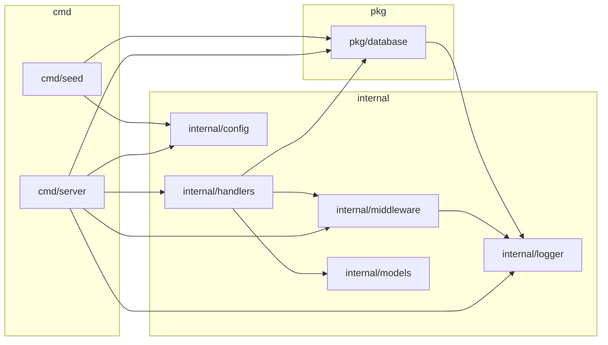
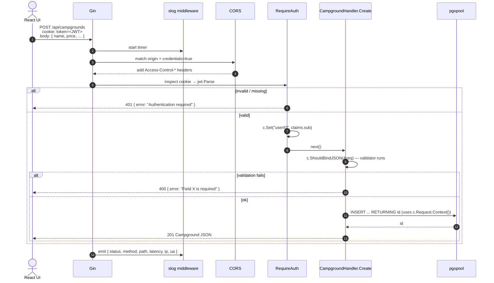
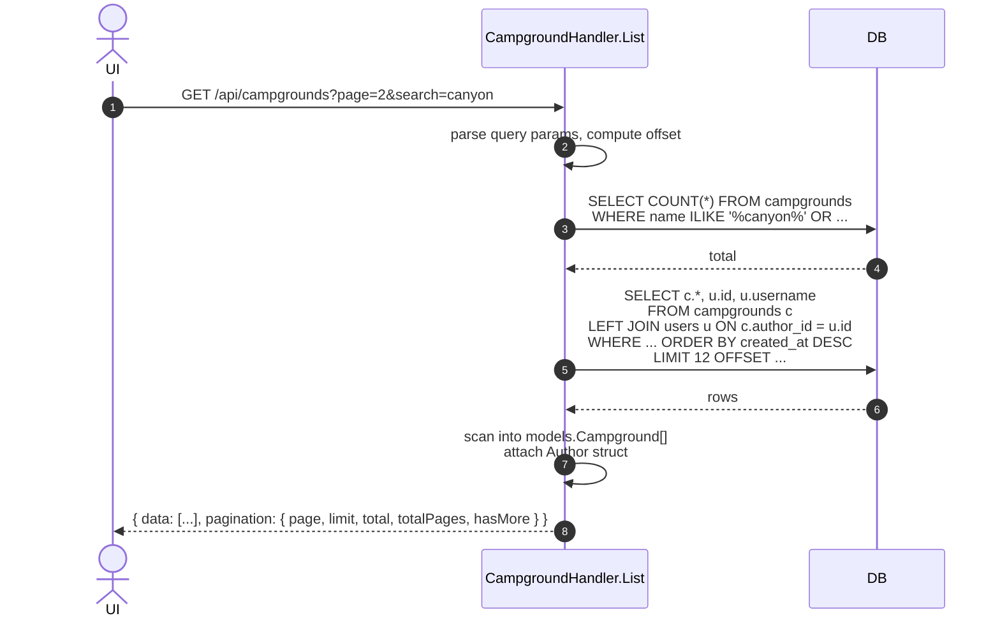
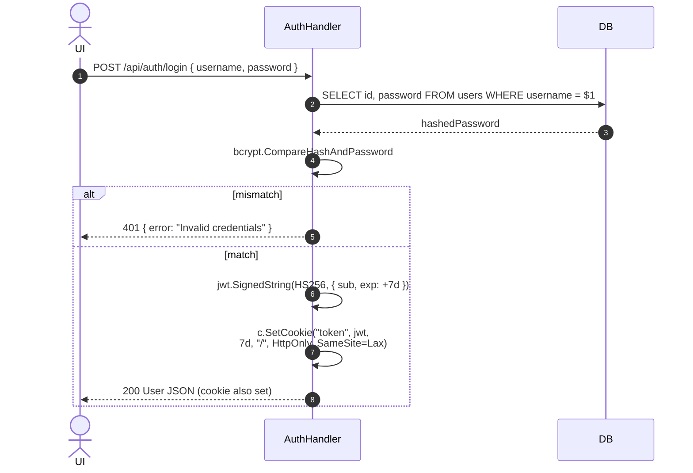
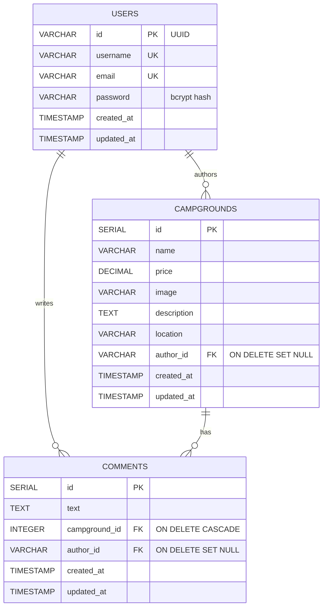
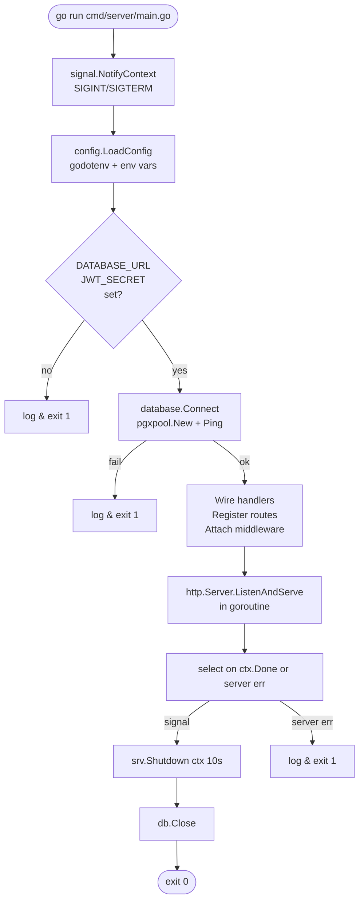

# Architecture — YelpCamp Go API

Design goals for this backend, in priority order:

1. **Boring.** Stdlib first (`log/slog`, `net/http`, `context`). Gin for
   routing/middleware only. No ORM — SQL is a skill, hide it and you
   lose it.
2. **Single static binary.** `go build` produces one artifact. Config
   comes from the environment, not a YAML tree.
3. **Strict layer boundaries.** `cmd → internal → pkg`, no reverse edges.
4. **Explicit over magic.** Handler bodies are long and readable; no
   repository pattern, no reflection-heavy routing. What you see is what
   runs.

---

## 1. System context



Every UI in the monorepo speaks the same HTTP contract, so the Go API is a
drop-in replacement for the Hono or Nitro backends. Postgres is shared — the
same `yelpcamp` database is used by every backend, but only one can be active
at a time (they are alternatives, not peers).

---

## 2. Package topology

```
cmd/                     ← entry points only (package main)
 ├── server/main.go       wires Gin, loads config, starts HTTP server
 └── seed/main.go         reseeds the DB; also uses internal + pkg

internal/                 ← app-private, no external import allowed
 ├── config/              env-driven config struct
 ├── logger/              slog singleton
 ├── handlers/            HTTP handlers (take *gin.Context)
 │    ├── auth.go
 │    ├── campground.go
 │    └── comment.go
 ├── middleware/          RequireAuth (JWT)
 └── models/              domain structs + request DTOs (validator tags)

pkg/
 └── database/            pgxpool factory (also used by cmd/seed)
```



**Rule:** arrows only point right-then-down. `internal/config` can be
imported by anything; `internal/handlers` can't be imported by
`internal/config`. This is enforced by Go's visibility rules (`internal/`
can only be imported by siblings inside the same module).

---

## 3. Request lifecycle

### 3a. Middleware chain

Every request flows through this pipeline before reaching a handler:

```
Incoming HTTP
     │
     ▼
[ gin.Recovery() ]           ← catches panics → 500, keeps server alive
     │
     ▼
[ ginLogMiddleware ]         ← slog request log with latency/status/IP
     │
     ▼
[ cors.New(…) ]              ← Access-Control-* headers,
     │                          allowlist includes :3005, :3003, CORS_ORIGIN
     ▼
[ (route group) ]            ← e.g., api := engine.Group("/api")
     │
     ▼
[ RequireAuth(secret) ]      ← only on protected routes:
     │                          1. Try `Authorization: Bearer …`
     │                          2. Fallback to `token` cookie
     │                          3. jwt.Parse(HS256) → claims.sub → context
     ▼
[ Handler ]
     │
     ▼
    JSON
```

### 3b. Authenticated mutation — "create campground"



**Why request context flows into pgx:** if the client disconnects mid-query
(browser tab closed, reverse proxy timeout), `pgx` sees the cancellation
and drops the query on the floor. Handlers get cheap cancellation for free
by using `c.Request.Context()`.

### 3c. Public read — "list campgrounds with search"

Two SQL round-trips: COUNT first (for pagination metadata), then the page.
`ILIKE` with a `%search%` pattern — acceptable for a small dataset, would
want pg_trgm / `tsvector` in production.



---

## 4. Auth model

### JWT issuance + transport



**Choices:**

- **Cookie over localStorage.** `HttpOnly` means JS in the page can't read
  the token; no XSS-stealable auth material.
- **SameSite=Lax.** Enough for same-site deployments; blocks CSRF from
  cross-origin navigations. Cross-site prod deploys need `SameSite=None;
  Secure` — change in `setTokenCookie`.
- **HS256 with shared secret.** Simple and sufficient for a single backend.
  If multiple services needed to verify tokens, switch to RS256 with a
  JWKS endpoint.
- **7-day expiry.** No refresh tokens, no rotation — deliberate simplicity.

### Authorization

There are only two authz rules in this app:

1. **Logged in?** `RequireAuth` middleware handles this; failure is 401.
2. **Own this row?** Done per-handler via a `SELECT author_id WHERE id = $1`
   before mutation, followed by `if *authorID != userID → 403`. Explicit,
   greppable, zero framework magic.

No roles, no ACL, no policy engine. If/when the app grows one, this is the
single layer that needs replacing.

---

## 5. Data model

### Schema



### Referential-integrity rules

- Deleting a **user** leaves their campgrounds and comments in place with
  `author_id = NULL`. The UI renders this as "Unknown" author.
- Deleting a **campground** cascades to its comments — comments don't
  belong to anyone else, so they have no meaning without the parent.
- No soft-deletes. Not worth the complexity for this app.

### Indexes

Both foreign-key columns are indexed (`idx_campgrounds_author_id`,
`idx_comments_campground_id`, `idx_comments_author_id`). The list query
scans sequentially for search since the dataset is small; switch to
`GIN (to_tsvector(...))` or a `pg_trgm` index if it grows.

---

## 6. Handler anatomy

A representative handler so the pattern is obvious:

```go
// Owner-only mutation — reads userID, checks ownership, then writes.
func (h *CampgroundHandler) Update(c *gin.Context) {
    userID := middleware.GetUserID(c)           // set by RequireAuth
    id, err := strconv.Atoi(c.Param("id"))
    if err != nil { /* 400 */ }

    var authorID *string
    err = h.db.QueryRow(c.Request.Context(),
        "SELECT author_id FROM campgrounds WHERE id = $1", id,
    ).Scan(&authorID)
    if err != nil { /* 404 */ }
    if authorID == nil || *authorID != userID { /* 403 */ }

    var req models.UpdateCampgroundRequest
    if err := c.ShouldBindJSON(&req); err != nil { /* 400 */ }

    _, err = h.db.Exec(c.Request.Context(), updateSQL, ...)
    if err != nil { /* 500 */ }
    c.JSON(http.StatusOK, gin.H{"message": "Campground updated"})
}
```

Every handler follows the same shape:

1. Extract user + path params.
2. Authorization check (if owner-only).
3. Parse + validate body with `ShouldBindJSON`.
4. SQL.
5. Respond.

There is deliberately **no repository, no service layer, no use-case
object**. When the same handler logic starts repeating across three
handlers, that's the trigger to introduce an abstraction — not before.

---

## 7. Config + startup



The `main()` function is 100 lines and fits on a screen. Everything that
can fail at startup is validated eagerly — if the secret is missing, the
process dies before binding a port.

---

## 8. Observability

Every request emits one structured log line:

```json
{
  "time": "2026-04-15T03:00:40Z",
  "level": "INFO",
  "msg": "incoming request",
  "status": 200,
  "method": "GET",
  "path": "/api/campgrounds",
  "ip": "::1",
  "user_agent": "Mozilla/5.0 …",
  "latency": 2364519
}
```

Level is derived from status:
- `>= 500` → `ERROR`
- `>= 400` → `WARN`
- else     → `INFO`

**What's missing vs. production:**

- No tracing (would add `otelgin` middleware)
- No metrics (Prometheus middleware, or `/metrics` with `promhttp`)
- No panic alerting — panics turn into 500s via `gin.Recovery()` but
  aren't flagged separately in logs

---

## 9. Deployment shape

```
┌────────────────────────────┐
│  Builder stage              │
│  (Dockerfile multi-stage)   │
│                             │
│  FROM golang:1.24           │
│    go mod download          │
│    go build -o api ./cmd/server
└───────────────┬────────────┘
                │ COPY --from=builder /api
                ▼
┌────────────────────────────┐     ┌──────────────────────┐
│  Runtime stage (distroless)│     │  Postgres            │
│                             │     │  (Supabase / Neon /  │
│  ENTRYPOINT ["/api"]        │──▶  │   self-hosted)       │
│  ENV JWT_SECRET …           │ SQL │                      │
│  EXPOSE 3004                │     │                      │
└────────────────────────────┘     └──────────────────────┘
          ▲
          │ HTTPS (cookies)
          │
    Reverse proxy
    (Caddy / Traefik)
          ▲
          │
        Browser
```

The binary is static — no runtime dependencies beyond glibc (or build with
`CGO_ENABLED=0` for fully static → scratch/distroless). Memory footprint
is ~10–20 MB idle, plus whatever pgxpool holds open.

---

## 10. Extension points

Where to cut when the app grows beyond what this layout supports:

| Pressure                          | Where to cut                                       |
| --------------------------------- | -------------------------------------------------- |
| Handler duplication (2+ copies)   | Introduce a `internal/service/` layer              |
| Complex joins everywhere          | Introduce `internal/repo/` — not before            |
| Migrations you can't run manually | Adopt `golang-migrate/migrate`                     |
| Multiple auth methods             | Split `middleware/auth.go` into strategies         |
| Roles / ACL                       | Add `middleware/RequireRole`, drop inline checks   |
| Observability                     | `otelgin`, `promhttp`, structured traces           |
| Background jobs                   | Separate binary; share `pkg/database`              |

Resist refactoring to abstractions before there's concrete pressure for
them. This layout is deliberately small; trust it until you feel the seams.
