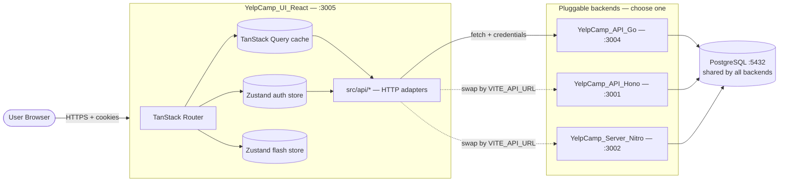
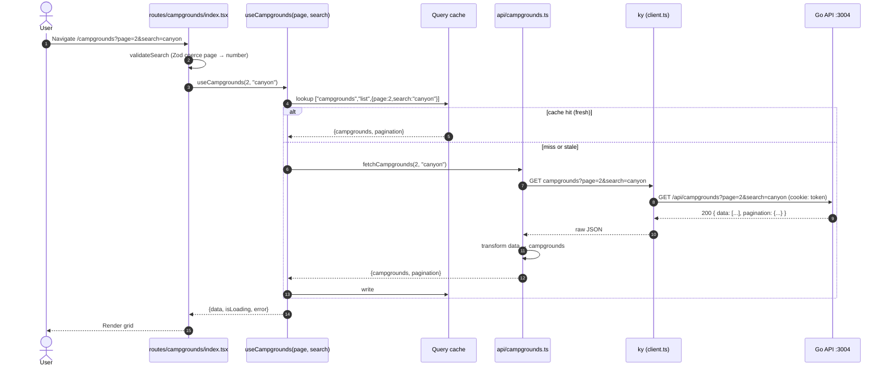
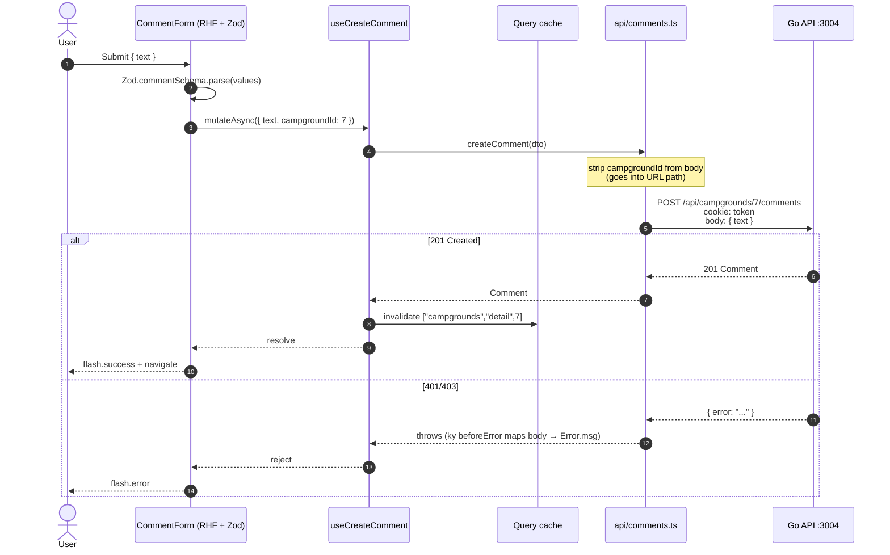
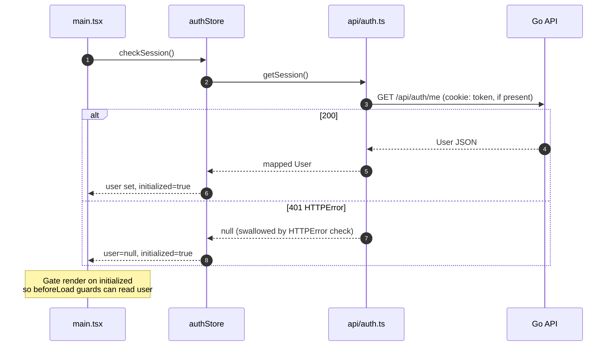
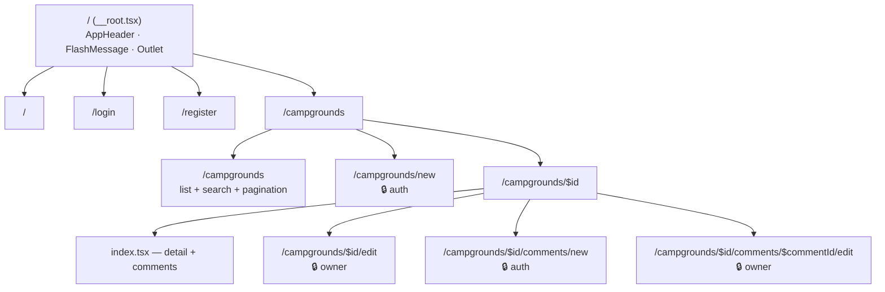

# Architecture — YelpCamp React UI

This document explains how the React UI is structured, how data flows through
it, and *why* certain seams exist where they do. The mental model is:

> **The UI knows nothing about the backend except through `src/api/*.ts`.**
> That's the only file tree you have to rewrite when the backend changes.

---

## 1. System context

Where this app lives and what it talks to.



The backend choice is a single env var (`VITE_API_URL`) plus whatever adapter
shape work happens inside `src/api/*`. Everything above that layer is
backend-agnostic.

---

## 2. Layer map

Strict inward-only dependency direction — routes depend on hooks, hooks
depend on API adapters and stores, API adapters depend on the `ky` client.
Nothing goes the other way.

```
┌──────────────────────────────────────────────────────────────┐
│  Routes (TanStack Router, file-based)                        │
│  src/routes/**  — pages, beforeLoad guards, form submission  │
└───────────────────────────┬──────────────────────────────────┘
                            │ useX() hooks
                            ▼
┌──────────────────────────────────────────────────────────────┐
│  Hooks (TanStack Query)                                      │
│  src/hooks/use-campgrounds.ts, use-comments.ts               │
│  — query-key factories, mutation with invalidation           │
└───────────────┬──────────────────────────┬───────────────────┘
                │                          │
                │ reads/writes             │ reads cached user
                ▼                          ▼
┌──────────────────────────────┐  ┌────────────────────────────┐
│  API adapters                │  │  Stores (Zustand)          │
│  src/api/auth.ts             │  │  stores/auth-store.ts      │
│  src/api/campgrounds.ts      │  │  stores/flash-store.ts     │
│  src/api/comments.ts         │  │                            │
└──────────────┬───────────────┘  └────────────────────────────┘
               │
               ▼
┌──────────────────────────────────────────────────────────────┐
│  src/api/client.ts — ky instance                             │
│  • prefix = VITE_API_URL + "/api"                            │
│  • credentials: "include"  (session cookie flows auto)       │
│  • beforeError unwraps {message} or {error} into Error.msg   │
└──────────────────────────────────────────────────────────────┘
               │
               ▼  HTTP
          Backend API
```

### Why these seams?

- **Routes never import `ky` directly.** Without this rule, backend refactors
  leak everywhere. Today only `src/api/*` has to change.
- **Hooks own caching + invalidation, not routes.** Routes just `useX()`.
  Multiple routes sharing a query get free deduping.
- **Stores are for cross-route state that survives navigation** (who's logged
  in, transient flash messages). Anything server-owned goes in TanStack
  Query, not Zustand.

---

## 3. Request flow — list campgrounds (read)



**Notable transform:** the Go API returns `{data, pagination}`, but the rest
of the app uses `{campgrounds, pagination}`. That rename is the only
adapter-layer responsibility for this endpoint.

---

## 4. Request flow — authenticated mutation (create comment)



**Why the body is just `{ text }`:** the Go route is nested under the campground
(`/campgrounds/:campgroundId/comments`), so `campgroundId` is a path param, not
a body field. The adapter enforces this contract.

---

## 5. Auth lifecycle

Session check runs once on app boot, then the store is the source of truth
for "am I logged in" for the rest of the session.



Routes that require auth use `beforeLoad`:

```ts
beforeLoad: () => {
  const { user } = useAuthStore.getState()
  if (!user) throw redirect({ to: '/login' })
}
```

Zustand stores are explicitly designed to work outside React — `.getState()`
and `.setState()` both function in router guards and `main.tsx`, before any
component mounts.

---

## 6. State ownership matrix

Who owns what piece of state, and why.

| State                    | Owner             | Why                                          |
| ------------------------ | ----------------- | -------------------------------------------- |
| Current user             | Zustand           | Cross-route, must be readable outside React  |
| Flash messages           | Zustand           | Enqueued from anywhere (guards, mutations)   |
| Campground list + detail | TanStack Query    | Server-owned, needs cache / invalidation     |
| Comments of a campground | TanStack Query    | Nested under campground detail               |
| Form values              | React Hook Form   | Local to a single form, never shared         |
| URL search params        | TanStack Router   | The URL *is* the state for list pagination   |
| Route-local UI state     | `useState`        | e.g., "which comment is being deleted"       |

Explicit rule: **server data never leaks into Zustand.** If you need
optimistic UI, use TanStack Query's mutation state.

---

## 7. Rendering + theming

Tailwind 4's `@theme` block in `src/app.css` is the single source of
truth for colors. Components use semantic utility classes
(`bg-card`, `text-muted-foreground`, `border-border`) — never raw grays.

```
src/app.css
  └── @theme tokens ──┐
                      ▼
       ┌─ shadcn primitives (bg-background, border-input, …)
       │
       ├─ custom components (bg-card, text-muted-foreground, …)
       │
       └─ route pages (inherit everything)
```

Flipping to light mode = edit `app.css` only. Nothing else hardcodes a
color.

---

## 8. Routing graph

File-based routes under `src/routes/`. Everything under `/campgrounds/` lives
in a single directory, with nested `$id/...` segments for detail pages.



🔒 = route has a `beforeLoad` guard. Owner-only routes *also* re-check
ownership after the campground/comment loads, because the router guard can
only see `user`, not `authorId`.

---

## 9. Testing topology

```
tests/
├── unit/                # Pure logic, fast (<10ms each)
│   ├── api/             # Pin the wire format — any shape drift goes red
│   ├── hooks/           # Mutation + invalidation behaviour
│   ├── stores/          # Zustand transitions
│   ├── routes/          # URL search-schema coerce (regression)
│   └── validation/      # Zod schema edges
│
├── components/          # Render + interaction, jsdom
│   # Uses @testing-library + userEvent, mocks @/api/*
│
└── integration/         # Full flows with mocked network
    # Mount whole route tree, simulate click-through, assert UI state
```

**Testing philosophy:**

- **API adapter tests are the load-bearing safety net.** They pin every URL,
  method, body, and response-shape transform. If the Go API changes, these
  go red *before* integration tests do, with tighter localization.
- **Components mock `@/api/*`, not `ky`.** That keeps tests about component
  behaviour, not about the adapter layer.
- **Integration tests mock the network layer** (`@/api/*`) and exercise the
  full route tree — they catch cross-layer bugs that unit tests miss (e.g.,
  optimistic updates that desync with cache invalidation).

---

## 10. Deployment model

```
┌──────────────────────┐   ┌──────────────────────────┐
│  Static host         │   │  Backend host            │
│  (Vercel/Netlify/S3) │   │  (Go binary on fly.io,   │
│                      │   │   Render, or a VPS)      │
│  vite build artifact │   │                          │
│  + cookie-domain URL │   │  single static binary    │
└──────────┬───────────┘   └─────────┬────────────────┘
           │ HTTPS                   │ SQL
           ▼                         ▼
   Visitor's Browser           ┌────────────┐
           │                   │ Postgres   │
           └─── cookies ──────►│ (Supabase, │
                               │  Neon, …)  │
                               └────────────┘
```

Because auth is cookie-based, the browser must accept cookies from the API
origin — either same-site (reverse proxy both under one domain) or
cross-site with `SameSite=None; Secure` in prod. The Go middleware currently
sets `SameSite=Lax`, which is the right choice for same-site deployments.

---

## Appendix: key contracts

These are the tight coupling points between this UI and any backend.

### Auth response shape

`GET /api/auth/me`, `POST /api/auth/login`, `POST /api/auth/register` all
return a bare `User`:

```ts
interface User { id: string; username: string; email?: string }
```

### Campgrounds list response

```ts
// Over the wire (Go):
{ data: Campground[], pagination: { page, limit, total, totalPages, hasMore } }

// After api/campgrounds.ts transform (in-app):
{ campgrounds: Campground[], pagination: ... }
```

### Error response

Any non-2xx response with `{ error: string }` or `{ message: string }` gets
unwrapped into `Error.message` by `src/api/client.ts`'s `beforeError` hook,
so calling code can do `catch(e) { flash.error(e.message) }`.
